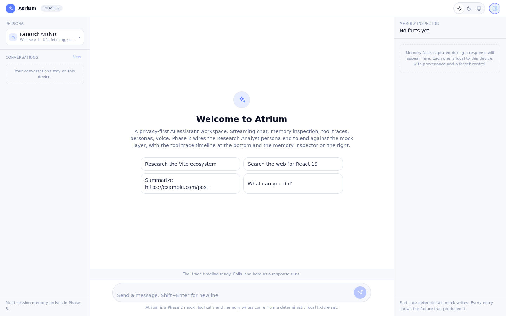
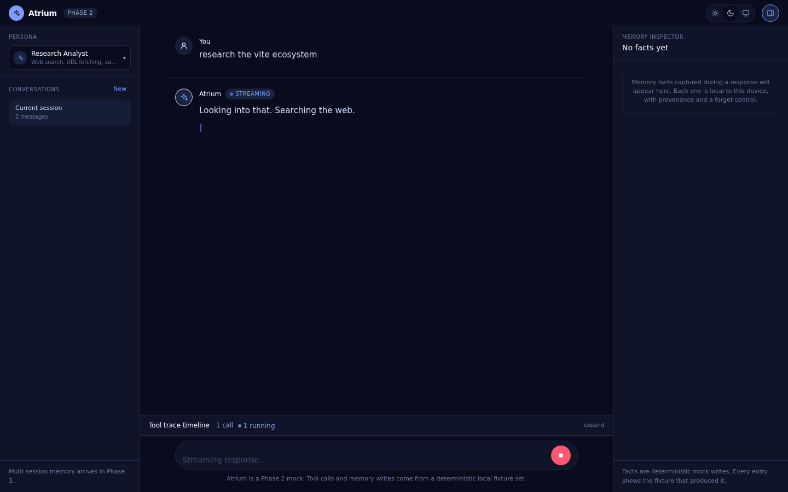
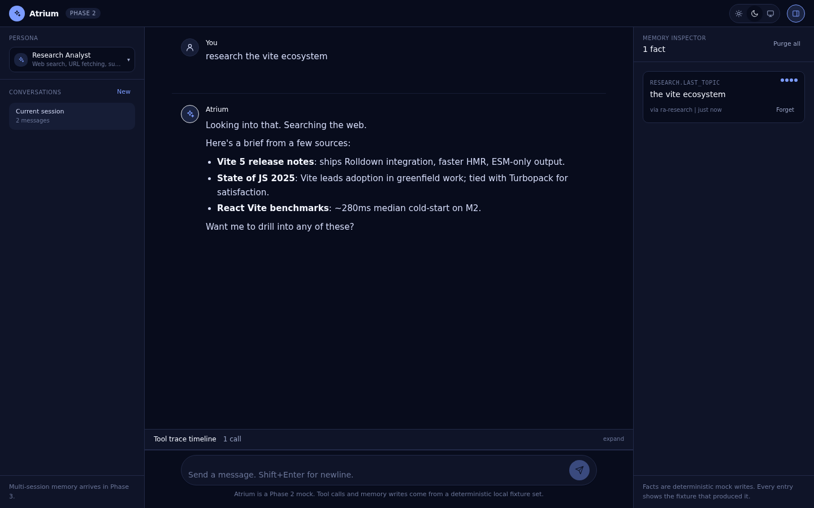
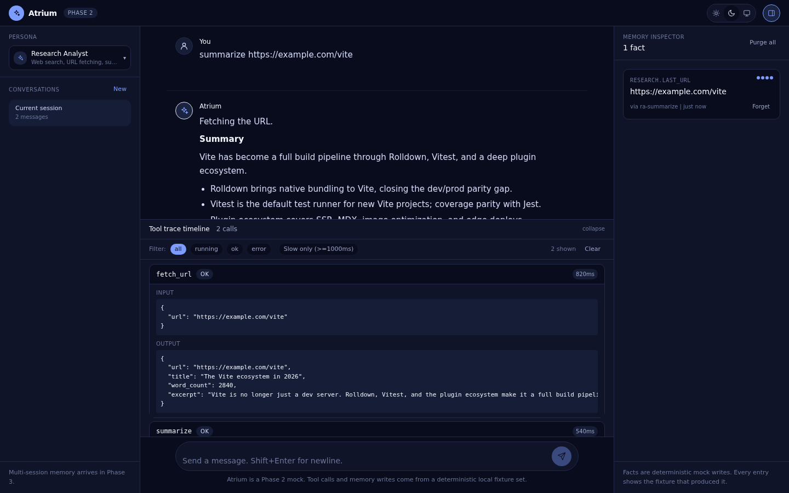
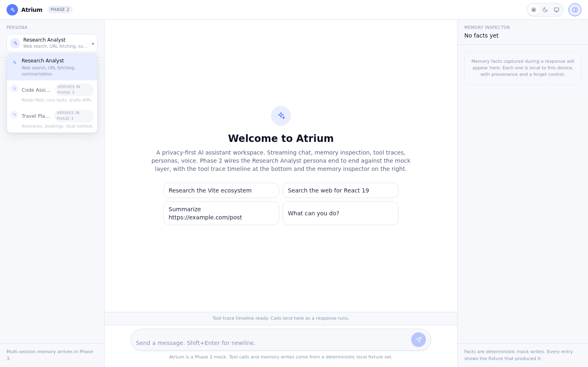

# Atrium

A privacy-first AI assistant workspace. Streaming chat, memory inspection, tool traces, persona switching, voice, all in a polished React 18 + Vite + TypeScript shell.

Atrium is a front-end-only reference UI for the privacy-first AI assistant category. Every streaming token, tool call, persona switch, and memory mutation is wired against a deterministic mock layer so the UX is the hero and the project ships fast.

## Why this category

The "privacy-first AI assistant" pattern is a real product category in 2026, not a one-vendor experiment. The clearest market signal is **Swisper AI** (Zurich, built by Fintama): a Swiss-hosted privacy-first assistant with hybrid LLM orchestration and contract-driven workflows, hiring senior React 18 and Vite engineers as of May 2026. Mistral's Le Chat, Proton's assistant, and a handful of other EU-aligned privacy-first assistants share the same UX shape: streaming chat as the front door, a memory or "what the assistant knows about you" surface, tool traces for trust, persona switching for different jobs, voice as a first-class input, and a strong privacy story made visible in the UI.

Atrium is a general-purpose reference UI for that category. It is not a clone of any one product. It exists so anyone evaluating senior React talent for an AI-native assistant can see the patterns implemented end to end, against a real CI pipeline, with the design system documented, instead of a slide deck.

## What it shows

1. **Streaming chat** with token-by-token reveal, cancel, retry, edit-and-resend, syntax-highlighted code blocks, safe markdown.
2. **Memory inspector** side panel that shows what the assistant remembers per session and across sessions, with per-fact provenance and a forget control.
3. **Tool trace timeline** drawer with per-call name, input, output, latency, status, expandable payloads, filters.
4. **Persona switcher** with three personas (Research Analyst, Code Assistant, Travel Planner), each with its own avatar, system prompt summary, default tools, and fixtures.
5. **Voice input** via the Web Speech API with a live waveform, push-to-talk and toggle modes.
6. **Multimodal** drag-drop and paste for images and files, inline file viewer for PDFs and code, deterministic mock analysis output.
7. **Workspace canvas** split view that hosts a markdown editor, a file viewer, or a sandbox iframe; assistant turns can pin content to the canvas.
8. **Privacy UX** with per-message data-scope badges (local, session, persistent), visible "data stays local" indicators, one-click session purge.
9. **Command palette** (cmd+K) to switch persona, switch theme, jump to setting, run saved prompts, fuzzy-search recent conversations.
10. **Theming** with light, dark, and system modes, design tokens documented in Storybook, one opinionated theme that looks shipped.

## Phases

- **Phase 0 (done):** scaffold. Repo, CI green, hello-world page rendering, full toolchain installed.
- **Phase 1 (done):** app shell, design tokens, light/dark/system themes, deterministic SSE simulator, streaming chat with send/cancel/retry/edit, markdown and code blocks with copy.
- **Phase 2 (done):** Research Analyst persona wired end to end, tool trace timeline (filters by status and latency, per-call input/output drill-down), memory inspector with per-fact provenance and a forget control, persona switcher with Phase 3 stubs reserved.
- **Phase 3:** all three personas, persona switcher transitions, command palette, theming polish.
- **Phase 4:** voice input, multimodal attachments, workspace canvas split view.
- **Phase 5:** privacy UX, Storybook coverage for every primitive, Playwright e2e for all 10 features, Lighthouse and axe-core gates in CI.
- **Phase 6 (optional):** swap the mock layer for a real backend (FastAPI + LangGraph + Ollama + pgvector) without touching feature code.

Current status: Phase 2 complete.

## Screenshots

Files live in [`/screenshots/`](./screenshots/) and are embedded below. Each phase adds new captures.

**Empty state (light theme):** persona switcher, suggested prompts tuned for the Research Analyst, memory inspector waiting on the right, trace timeline peek bar at the bottom.

**Mid-stream research with a running tool call (dark theme):** assistant streams while the trace timeline shows a `running` tool call in the bottom drawer.

**Research complete with a memory fact landed (dark theme):** the assistant's brief, the tool trace peek, and a new fact in the memory inspector with its provenance line.

**Trace drawer expanded with tool input and output (dark theme):** the trace timeline drawer expanded with the `fetch_url` call open, showing input + output JSON. Filter pills toggle between all, running, ok, error, and slow-only.

**Persona switcher menu (light theme):** the persona menu open in the left rail, with the Research Analyst active and the Code Assistant and Travel Planner stubs marked as Phase 3.

